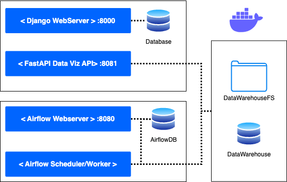

# TIP_project
This project is part of technology innovation project

## project structure
```
.
├── AIRFLOW
│   ├── README.md
│   ├── dags
│   ├── docker
│   ├── docker-compose.yml
│   ├── logs
│   ├── plugins
│   └── scripts
├── APP
│   ├── Dockerfile
│   ├── README.md
│   ├── TIP_Project
│   ├── app01
│   ├── dataviz
│   ├── db.sqlite3
│   ├── manage.py
│   ├── requirements.txt
│   ├── search
│   └── suburb_finder
├── DOCKER
│   ├── docker-compose.yml
│   └── tmp_data
├── README.md
├── WAREHOUSE
│   ├── API
│   ├── Dockerfile
│   ├── __pycache__
│   ├── connections
│   ├── main.py
│   └── requirements.txt
├── src
│   └── TIPDiagram.drawio.png
└── tmp_data
    └── data

```

## Pre-requisites
1. docker
2. docker-compose
3. python3

## How to run the stack

### running the app server
1. configure .env file
```bash
cp ./DOCKER/.env.example ./DOCKER/.env
```

2. edit the file

3. build and run the stack
```bash
docker-compose -f ./DOCKER/docker-compose.yml up --build
```


#### if in doubt
run this command to remove the persistent docker container and volumes with new .env settings
```bash
docker-compose -f ./DOCKER/docker-compose.yml down -v
```


## Container used in this project


The [docker-compose file](./DOCKER/docker-compose.yml) that we use defines a multi-container application consisting of several services that work together to provide a web application, a MySQL database, a PHPMyAdmin interface, a Redis cache, a PostgreSQL database, an Apache Airflow web server, and a Warehouse API.

The web service is the main web application service. It uses an image called webapp and builds the application using a Dockerfile located in the ../APP directory. It runs the Django web server on port 8000 and depends on the mysql and web-migrate services.

The web-migrate service is used to perform database migrations. It also uses the webapp image and runs the python manage.py migrate command. It depends on the mysql service.

The mysql service provides the MySQL database for the application. It uses the official MySQL Docker image and sets the database name, user, password, and root password as environment variables. It also maps port 3306 to allow connections from outside the container.

The myphpadmin service provides a web-based interface for managing the MySQL database. It uses the official PHPMyAdmin Docker image and maps port 5050 to allow connections from outside the container. It also sets the hostname and root password as environment variables.

The warehouse-api service builds a Warehouse API image from a Dockerfile located in the ../WAREHOUSE directory. It depends on the cache service and maps port 8080 to allow connections from outside the container. It sets the Redis host and port as environment variables and mounts the ../tmp_data/data directory as a volume.

The postgres service provides the PostgreSQL database for the Apache Airflow web server. It uses the official PostgreSQL Docker image and sets the database name, user, password, and data volume as environment variables. It also maps the data volume to allow data persistence.

The airflow-webserver service provides the Apache Airflow web server. It uses the official Apache Airflow Docker image and depends on the postgres service. It sets several environment variables related to Airflow and the Warehouse API. It also mounts the ../AIRFLOW directory as volumes for DAGs, logs, and plugins.

The cache service provides a Redis cache for the application. It uses the official Redis Docker image and maps port 6379 to allow connections from outside the container. It also sets a command to start the Redis server and mounts a volume to allow data persistence. However, it is currently commented out and not used in the application.

Overall, this docker-compose file defines a complex multi-container application that integrates several services and technologies to provide a complete web application with a database, a cache, and a workflow management system.
